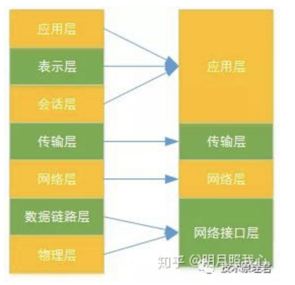
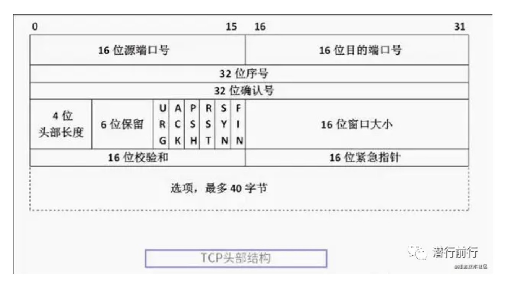
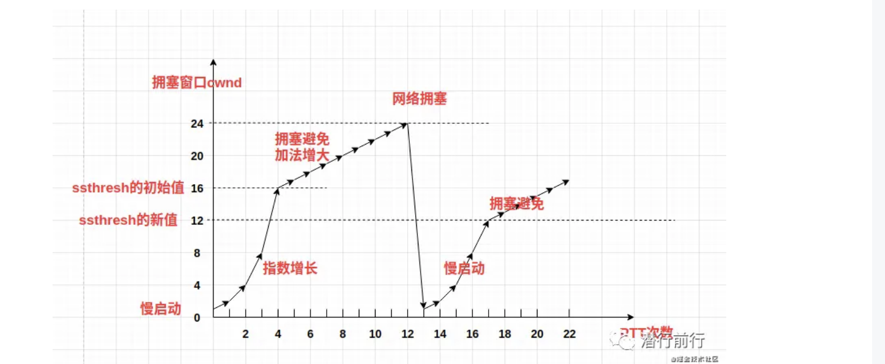
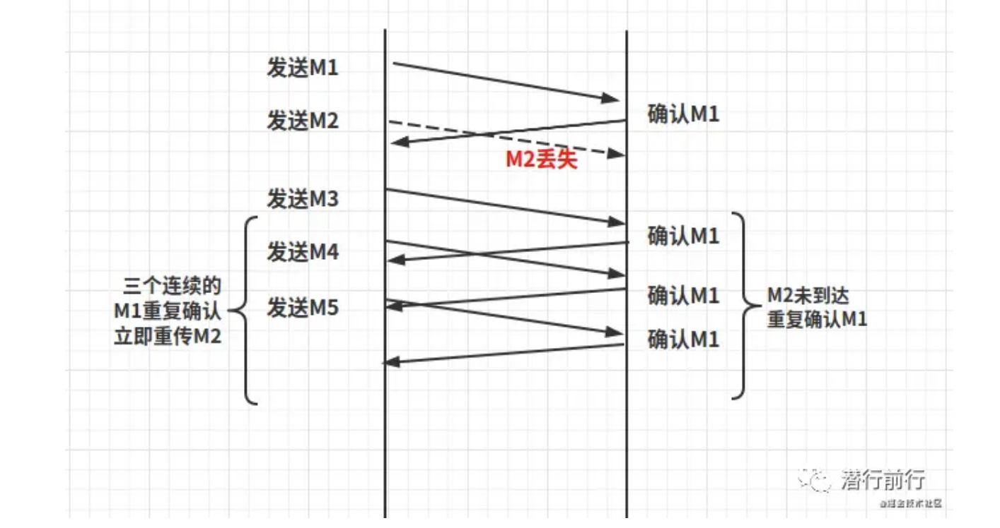
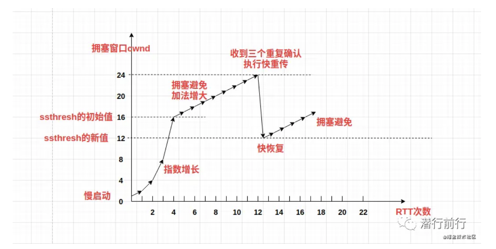

## 网络分层模型
### OSI七层模型
* 应用层
* 表示层
* 会话层
* 传输层
* 网络层
* 数据链路层
* 物理层

1. 传输层   
OSI模型中最重要的一层。传输协议同时进行流量控制或是基于接收方可接收数据的快慢程度规定适当的发送速率。除此之外，传输层按照网络能处理的最大尺寸将较长的数据包进行强制分割。最著名的当属TCP和UDP了。

2. 网络层       
OSI模型的第三层，其主要功能是将网络地址翻译成对应的物理地址，并决定如何将数据从发送方路由到接收方。网络层通过综合考虑发送优先权、网络拥塞程度、服务质量以及可选路由的花费来决定从一个网络中节点A 到另一个网络中节点B 的最佳路径。由于网络层处理，并智能指导数据传送，路由器连接网络各段，所以路由器属于网络层。在网络中，“路由”是基于编址方案、使用模式以及可达性来指引数据的发送。 网络层负责在源机器和目标机器之间建立它们所使用的路由。这一层本身没有任何错误检测和修正机制，因此，网络层必须依赖于端端之间的由DLL提供的可靠传输服务。 IP就是属于这一层。

3. 会话层       
负责在网络两节点之间建立，维持和终止通信。会话层功能包含：建立通信连接，保持会话过程通信连接的畅通，同步两个节点之间的对话，决定通信是否被中断以及通信中断时决定从何处重新发送。 例如：DNS

4. 表示层       
应用程序和网络之间的翻译官，在表示层，数据将按照网络能理解的方案进行格式化;这种格式化也因所使用网络的类型不同而不同。 表示层管理数据的解密与加密，如系统口令的处理。例如：telnet

### TCP/IP四层模型

   
tcp/ip模型时互联网的基础，他是一系列网络协议的总称。这些协议可以分为四层，分别为链路层，网络层，传输层和应用层

* 链路层：负责封装和解封装IP报文，发送和接受ARP/RARP报文等。
* 网络层：负责路由以及把分组报文发送给目标网络或主机。
* 传输层：负责对报文进行分组和重组，并以TCP或UDP协议格式封装报文。
* 应用层：负责向用户提供应用程序，比如HTTP、FTP、Telnet、DNS、SMTP等。

## 阿里面试宝典   （https://www.bilibili.com/read/cv8702424）  
1. 讲讲你理解的网络模型     
网络模型一般分位七层：应用层，表示层，会话层，传输层，网络层，数据链路层，物理层；应用层的协议包括http，ftp，smtp，而tcp属于传输层，ip协议属于网络层。tcp/ip网络模型层次由上到下，层层包装，每一层都对应不同的协议解析
  

2. tcp有自己的首部结构，这都有哪些字段，最好说说他们的作用      

tcp的首部结构先是16位的源端口号和目标端口号，接着是32位的序列号和确认号，在下面就是4bit的头部长度和6bit的保留位及6bit的标识位

    16位的属性则有窗口大小(控制发送窗口)，检验和(校验数据段是否未被修改)及紧急指针。最后是选项，其长度由头部长度决定    

3. 序列号       

    序列号是tcp报文段的一数字编号，为保证tcp可靠连接，每一个发送的数据段都要加上序列号，建立连接时，两端都会随机生成一个初始序列号。而确认号是和序列号配合使用的，应答某次请求时，则返回一个确认号，他的值等于对方请求序列号加1

4. 6个标志位    
    * urg：紧急信息
    * ack：应答信息
    * psh：缓冲区尚未填满
    * rst：重置连接
    * syn：建立连接消息标示
    * fin：连接关闭信息
5. 窗口大小： 窗口大小是接收端用来控制发送端的滑动窗口大小
6. tcp和udp有什么区别       
    * 连接方面：tcp面向连接，udp面向无连接，发送数据之前不需要建立连接
    * 安全方面：tcp提供可靠的服务，保证传送的数据，无差错，不丢失，不重复，且按序达到。udp则是尽最大努力交付，不保证可靠交付
    * 传输效率： tcp传输效率较低，udp传输效率高
7. tcp是可靠的连接，他是怎么实现的      
    tcp是基于三次握手，而断开是四次挥手。为了保证数据不丢失及错误，他有报文校验，ack应答，超时重传(发送方)，失序数据重传(接收方)，丢弃重复数据，流量控制(滑动窗口)和拥塞控制等机制
8. 具体说一说三次握手和四次挥手     
        
    关闭连接时需要四次挥手，比建立时多了一次，是因为被动关闭端或许还有数据没被送出去，不能像握手时一样，第二次握手既是发起握手也是响应握手
9. 如果没有三次握手会有什么问题     
    如果只有两次握手，client发送连接请求不会在ack服务端的syn，此时若客户端因为自身原因判断建立连接失败，可能会重复建立tcp连接，而服务端却会认为那些被client丢弃的tcp还是有效的，会白白浪费资源

10. time_wait和close_wait的区别在哪         
    
    close_wait是被动关闭形成的；当对方close socket而发出fin报文，回应ack之后进入close_wait状态。随后检查是否存在未传输数据，如果没有则发起第三次挥手，发送fin报文给对方，进入last_ack状态并等待对方ack报文过来  

    time_wait是主动关闭连接方式形成的；处于fin_wait_2状态时，收到对方fin报文后进入time_wait状态；之后在等待两个MSL(报文段时长)
11. time_wait的作用是什么，为啥要等待两个MSL    
    tiem_wait的作用是为了保证最后一次挥手的ack报文能够送达给对方，，如果ack丢失了，对方会超时重传fin，主动关闭端会再次相应ack过去；如果没有time_wait状态，直接关闭，对方重传的fin报文则被响应一个rst报文，此rst会被关闭段解析成错误
    
    存在两个连接，第一个连接正常关闭，第二个相同的连接紧接着建立；如果第一个连接的迷路报文到来，则会干扰第二个连接，等待两个MSL则可以让上次连接的报文数据消逝在网络

12. tcp协议使用什么方式解决拥塞         
    1）慢启动：tcp发送端会维护一个拥塞窗口，简称为cwnd，拥塞窗口初始为一个报文段，每经过一次RTT (数据完全发送完到确认的时间)，窗口大小翻倍(指数增长，只是前期慢)        
    
    2）拥塞避免：他的思路是让拥塞窗口cwnd缓慢增大，发送方的cwnd达到阀值，ssthresh(初始值由系统决定)之后，每经过一个RTT就把拥塞窗口加一，而不是加倍mcwnd呈加法加大。

    如果遇到网络拥塞，拥塞窗口阀值ssthresh减半，cwnd设置为1，重新进入慢启动阶段
    

13. 拥塞控制还有其他什么方式            
    1）快重传：是当接收方收到一个失序的报文，则立马报告给发送方，赶紧重传       
    假如接收方M1收到了，M2没有收到，之后的M3，M4，M5又发送了，此时接受方一共连续给发送方法反馈了3个M1确认报文，。那么快重传规定，发送方只要连续收到了3个重复确认，立即重传对方发来的M2（重复确认报文后的一个报文）
    

    2)快恢复：当发送方连续收到三个重复确认，ssthresh减半；由于发送方可能认为网络现在没有拥塞，因此与慢启动不同，把cwnd值设置为ssthresh减半之后的值，然后执行拥塞避免算法，cwnd线性增大
           

14. 知道滑动窗口吗？客户端和服务端控制滑动窗口的过程是怎么样的      

    1）接收端将自己可以接受的缓冲区大小放入tcp首部中的窗口大小字段中，通过ack报文来通知发送端，滑动窗口是接收端来控制发送端发送数据的大小，从而达到流量控制

    2）其实发送方的窗口上限是取拥塞窗口和滑动窗口两者的最小值

15. 那你知道滑动窗口和拥塞窗口的区别不      

    相同点：都是控制丢包现象，实际机制都是让发送方发的慢一点        
    不同点：拥塞控制的对象是网络，怕发送方法发的太快，造成网络拥塞，使得网络来不及处理。流量控制的对象是接收方，怕发送方发的太快，使得接收方来不及处理

16. tcp的粘包和拆包问题     
    程序需要发送的数据大小和tcp报文段能发送MSS(最大报文长度)是不一样的。大于最大报文长度时，需要把程序数据拆分为多个tcp报文段，称之为拆包；小于时，则会考虑合并多个程序数据为一个tcp报文段，则是粘包；其中最大报文长度=tcp报文段长度-tcp首部长度。在ip协议层或者链路层，物理层，都存在拆包和粘包的情况。

17. 那解决拆包和粘包的方法有哪些？          
    1）在数据尾部增加特殊字符进行分割       
    2）将数据定为固定大小           
    3）将数据分为两部分，一部分是头部，一部分是内容体；其中头部结构大小固定，且有一个字段生命内容体的大小

18. syn flood了解吗         
    
    1）syn flood伪造syn报文向服务器发起连接，服务器在收到报文后用syn_ack应答，此应答发出后不会收到ack，造成一个半连接   

    2）若攻击者发送大量这样的报文，会在攻击主机上出现大量的半连接，耗尽资源，使正常流量无法访问，直到半连接超时。

19. 一次http请求程序经历了那些步骤      
    域名解析->发起tcp三次握手，建立连接->基于tcp发起http请求->服务器响应http请求，并返回数据->客户端解析返回数据

20. http状态码      

    200: 成功请求       
    400: 请求格式不对       
    401: 用户验证权限问题，一般是token没通过        
    403: 拒绝提供服务       
    404: 资源不存在     
    500: 服务器错误     
    503: 服务器临时维护，过载，可恢复

21. session和cookie有什么区别       

    1） 存储位置不同；cookie是保存在客户端的数据，session的数据存放在服务器上       
    2）存储容量不同：单个cookie保存的数据小，一个站点最多保存20个cookie，对于session来说是没有上线的        
    3）存储方式不同；cookie中只能保管ascll字符串，session中能够存储任何类型的数据       
    4）有效期上不同；cookie可以长期有效存在，session依赖名为 jsessionid cookie，过期时间默认为-1，只需关闭窗口该session就会过期     
    5）跨域支持上不同；cookie支持跨域名访问，session不支持跨域名访问

22. 大量的time_wait        
    * 出现的原因：高并发短链接的服务器上会出现这样的情况
    * 导致的问题：在socket的time_wait状态结束之前，该socket占用的端口一直被占用
    * 解决方式：调整系统的内核参数，允许time_wait的socket重新用于tcp链接，同时加快time_wait的socket的回收。更改短连接为长链接
