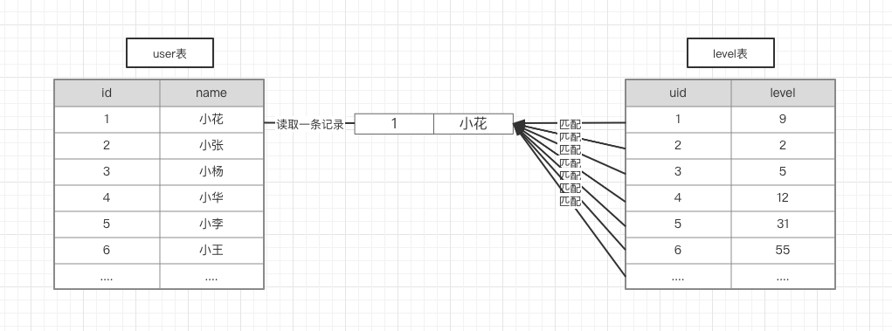
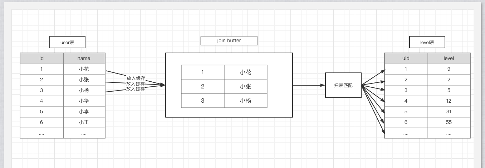

# Mysql Join算法原理

## Simple Nested-Loop Join(简单的循环嵌套连接)
简单来说嵌套循环连接算法就是一个双层for循环。通过循环外层表的行数据逐个与内层表的所有数据进行比较来获取结果。当执行
```go
select
    * 
from
    user 
left join
    level 
on user.id = level.user_id
```
具体的数据匹配类似如下：
```go
for (user 表的行 ur: user表) {
	for (level的行 lr: level表) {
	    if (ur.id == lr.user_id){
		    // 返回匹配成功的数据	    
        }
    }
}
```
匹配过程：

特点：nested-loop join简单粗暴容易理解，就是通过双层循环比较数据来获取结果，这种算法的比较次数将会是个笛卡尔乘积，在执行效率方面来看是非常底下的。mysql对这方面进行了优化

## index nested-loop join(索引嵌套循环链接)
idnex nested-loop join的优化思路主要是为了减少内层表数据的匹配次数，简单来说就是index nested-loop join就是通过外层匹配条件直接与内层索引就行匹配，避免和内层表的每条记录去进行比较
这样极大的减少了对内层表的匹配次数，从原来的匹配次数=外层表行数*内层表行数，变成了外层表行数*内层表索引的高度，极大的提升了join的性能。

例如： 

sql：select * from user tbl1 left join level tbl2 on tbl1.id = tbl2.user_id

当level表的user_id为索引的时候执行过程如下


注意：使用index nested-loop join算法的前提是匹配的字段必须建立索引

## Block Nested-loop join(缓存块嵌套循环连接)

block nested-loop join其优化思路是减少内层表的扫表次数，通过简单的嵌套循环查询的图，我们可以看到，左表的每一条记录都会对右表进行一次扫表，扫表的过程也就是从内存中读取数据的过程，那么这个过程其实是比较消耗性能的。
所以缓存块嵌套循环连接算法旨在通过一次性缓存外层表的多条数据，以此来减少内层表的扫表次数，从而达到提升性能的目的。如果无法使用index nested-loop join时，数据库默认使用的事block nested-loop join算法。


当level表的user_id不为索引的时候，默认会使用block nested-loop join算法，匹配过程如下：


这里和simple nested-loop join算法比较相像，区别在于block算法是每次拿一批进行匹配，simple是每次拿一条和内表进行匹配。
使用block nested-loop join算法需要开启优化器管理配置的optimizer_switch设置block_nested_loop默认为on，如果关闭则使用
simple nested-loop join算法，通过指令：show variables like 'optimizer_switc%'查看配置。 通过join_buffer_size参数可设置join buffer的大小


## join算法总结
无论是index nested-loop join还是block nested-loop join都是在simple nested-loop join的算法基础上进行优化，这里的index nested-loop join和block nested-loop join
算法分别堆join过程中循环匹配次数和io次数两个角度进行优化。

index nested-loop join是通过索引的机制减少内层表的循环匹配次数达到优化的效果，block nested-loop join是通过一次缓存多条数据批量匹配的方式来减少外层表的io次数，同时也减少
了内层表的扫表次数，通过理解join的算法原理我们可以得到以下的表链接查询优化思路：
* 永远使用小结果集驱动大结果集(其本质就是减少外层循环的数据量)
* 为匹配的条件增加索引(减少内存表的循环匹配次数)
* 增大join buffer size的大小(一次缓存更多的外层表数据，减少内层表的扫表次数，也减少了外层表的IO次数)
* 减少不必要的字段查询(字段越少，join buffer所缓存的数据就越多)


## 面试题
六种关联查询
1. 交叉连接(cross join)
   结果是笛卡尔积，就是第一行的行数乘以第二行的行数
2. 内连接(inner join)
   又叫等值连接，取左右表的交集，只返回两个表中连接字段相等的记录
3. 外连接(left join/right join)
   left join：保留左表的数据，返回左表中所有记录以及右表中连接字段相等的记录
   right join：保留右表的数据，返回右表中所有的记录以及左表中连接字段相等的记录
4. 联合查询(union与union all)
5. 全连接(full join)
   返回两个表中行，left join + right join

问：在使用left join的时候，on和where的条件有什么区别
1. on是在生成临时表时使用的条件，他不管on中的条件是否为真，都会返回左表中的记录
2. where条件在临时表生成好后，在对临时表进行过滤的条件。这时已经没有left join的含义了，作用在临时表上，条件不为真就全部过滤掉。

   以上结果的关键原因就是left join ，right join，full join的特殊性，不管on上的条件是否为真都会返回left或right表中的记录，
   full则具有right和left的特性的并集。而inner join没这个特殊性，则条件放在on中和where中，返回的结果集是相同的、

