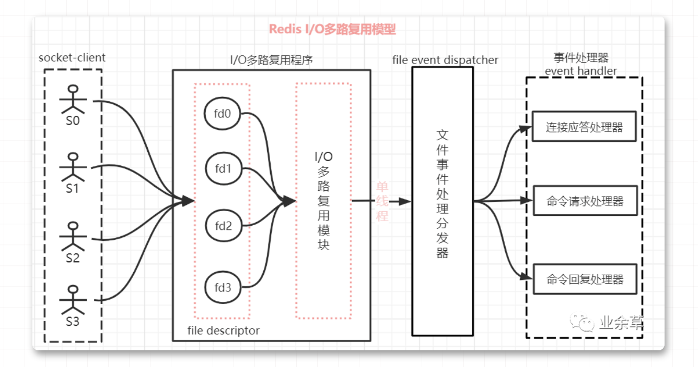
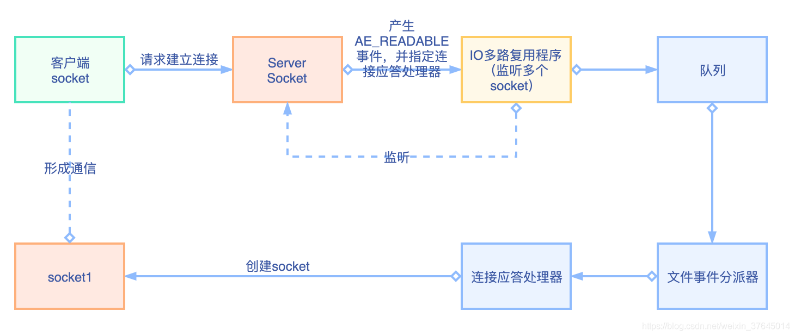
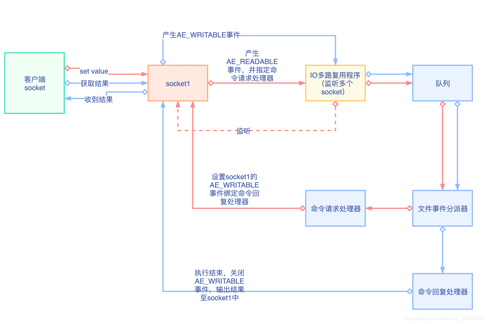

# redis    
## redis的数据结构    
1. 第一个层面，从使用者的角度，有string，list，hash，set，sorted set。这一层也是redis暴露给外部的调用接口
2. 第二个层面，从内部实现的角度，属于更底层的实现。比如：dict,sds
,ziplist, quicklist，skiplist

## 设计原则     
* 存储效率。redis是专门用于存储数据的，它对于计算机资源的主要消耗在于内存，因此节约内存是他非常重要的一个方向，这意味着redis一定需要考虑压缩数据，减少内存碎片的问题。
* 快速响应时间，与快速响应时间相对的是高吞吐量。redis是用于提供在线访问的，对于单个请求的响应时间要求很高，因此，快速响应时间是比高吞吐量更重要的目标，
* 单线程，redis的性能瓶颈不在于cpu资源，而在于网络访问和网络IO。而采用单线程的设计带来的好处是极大的简化了数据结构和算法的实现。相反，redis通过异步IO和pipelining等机制来实现高速的并发访问。

## redis中的i/o多路复用模型   （I/O多路复用程序函数有 select、poll、epoll、kqueue)
### 实现原理        
    redis的i/o多路复用模型有效的解决单线程的服务端，使用不阻塞方式处理多个client端请求问题。
### redis客户端连接
    redis通过监听一个tcp端口或者unix socket的方式来接收来自client端的连接，当一个连接建立后，redis内部会进行以下操作：  
    1） 首先，客户端socket会被设置为非阻塞模式，因为redis在网络事件处理上采用的是非阻塞多路复用模型     
    2）然后为这个socket设置tcp_nodelay属性，禁用nagle算法，然后创建一个可读的文件事件用于监听这个客户端socket的数据发送

### 阻塞i/o     
    在socket连接中，一个服务器进程和一个客户端进行通信时，当client端向服务端写数据时，如果client端没有发送数据，那么服务端read将一直阻塞，直到客户端write发来数据。在一个客户端和服务器通信没什么问题，当多个客户端，与一个服务器通信时，就存在问题了。

    1） 当一个client1和服务器建立连接后，服务器会一直阻塞于client1，直到client客户端write发来数据才开始后面的操作。服务器阻塞期间，即使有其他客户端client的数据提前到来，也不能处理client2客户端的请求。    
    2） 如果客户端client1一直阻塞没有write数据到来，那么服务端service会一直阻塞，不能处理其他客户的服务

### i/o多路复用     
1. 为什么redis要使用i/o多路复用这种技术？   
    因为redis是跑在单线程中的，所有的操作都是按照顺序线性执行的，但是由于读写操作等待用户输入或者输出都输阻塞的。所以i/o操作一般情况下往往不能直接返回，这会导致某一文件i/0阻塞，导致整个进程无法对其他客户提供服务。而i/o多路复用就是为了解决这个问题      
2. 详述     
    这里的多路指的是多个网络连接客户端； 复用是指复用同一线程（单进程）。i/o多路复用其实是使用一个线程来检查多个socket的就绪状态。在的那个线程中通过记录跟踪每一个socket(i/o流)的状态来管理多个i/o流。
    
    1）一个socket客户端与服务器连接时，会生成对应一个套接字描述符（fd）,每一个socket网络连接其实都对应一个文件描述符

    2）多个客户端与服务端连接时，redis使用i/o多路复用程序将客户端socket对应的fd注册到监听列表（一个队列中），当客户端执行read，write等操作命令时，i/o多路复用程序会将命令封装成一个事件，并绑定到对应的fd上。

    3）文件事件处理器使用i/o多路复用模块同时监听多个文件描述符的读写情况，当accept，read，write和close文件事件产生时，文件事件处理器就会回调fd绑定的事件处理器进行处理相关命令操作

    4)整个文件事件处理器是在单线程上运行的，但是通过i/o多路复用模块的引入，实现了同时对多个fd读写的监控，当其中一个client端达到写或者读的状态，文件事件处理器就马上执行，从而就不会出现i/o阻塞的问题。

    > 例如：以 Redis 的 I/O 多路复用程序 epoll 函数为例
    多个客户端连接服务端时，Redis 会将客户端 socket 对应的 fd 注册进 epoll，然后epoll同时监听多个文件描述符(FD)是否有数据到来，如果有数据来了就通知事件处理器赶紧处理，这样就不会存在服务端一直等待某个客户端给数据的情形。

    

    

## 流程
1. 首先客户端请求建立连接，服务端进程初始化，请求连接到server socket，server socket触发了AE_READABLE事件，并指定了连接应答处理器，然后进入IO多路复用程序，将server socket压入队列，文件事件分派器拿到socket后，判断是由连接应答处理器消费处理该socket，连接应答处理器创建一个socket1，socket1从而与客户端socket建立通信；

2. 进行setValue操作，socket1接收到setValue命令后触发AE_READABLE事件，并指定了命令请求处理器，然后进入IO多路复用程序，将server socket压入队列，文件事件分派器拿到socket后，判断是由命令请求处理器消费处理该socket，命令请求处理器执行setValue命令，将socket1的AE_WRITABLE事件绑定命令回复处理器。客户端准备好获取结果，触发了socket1的AE_WRITABLE事件，然后进入IO多路复用程序，将socket1压入队列，文件事件分派器拿到socket后，判断是由命令请求处理器消费处理该socket，将socket1的操作命令执行结果，返回socket1，socket1再告知客户端。

    