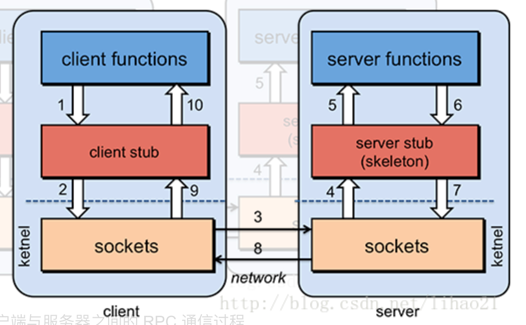

thrift版本：v0.14.2
# 基本概念
我们都知道rpc(Remote Procedure Call，远程过程调用)，是一个计算机通信协议，此协议允许进程间通信。简单来说就是，当A机器上的进程调用B机器上的进程时，A机器上的调用进程会被挂起，而B机器上的进程开始执行。
调用方将参数信息传送给被调用方，然后可以通过被调用方的结果得到返回。rpc可以不依赖应用层协议，直接给予rpc进行远程调用，在传输层就可以完成通信。由于rpc调用方式依赖客户端与服务端之间建立Socket连接来实现二
进制通信，底层会比较复杂，所以一些rpc框架就应运而生。 市面上目前主流的关于rpc协议实现有grpc，thrift,dubbo。而这些rpc框架一般来说都需要解决服务寻址，数据流的序列化和反序列化，网络传输这三个主要问题。

# rpc调用的基本流程

* 服务消费方（Client 客户端）通过本地调用的方式调用服务。
* 客户端存根（Client Stub）接收到调用请求后负责将方法、入参等信息序列化（组装）成能够进行网络传输的消息体。
* 客户端存根（Client Stub）找到远程的服务地址，并且将消息通过网络发送给服务端。
* 服务端存根（Server Stub）收到消息后进行解码（反序列化操作）。
* 服务端存根（Server Stub， 一段代码）根据解码结果调用本地的服务进行相关处理
* 服务端(Server)本地服务业务处理。
* 处理结果返回给服务端存根（Server Stub）。
* 服务端存根（Server Stub）序列化结果。
* 服务端存根（Server Stub）将结果通过网络发送至消费方。
* 客户端存根（Client Stub）接收到消息，并进行解码（反序列化）。
* 服务消费方得到最终结果。

# http和rpc
http和rpc其实不是对立面，我们知道rpc只是一个计算机通信协议框架，通信协议只是其中的一部分。而http协议作为网络七层模型中应用层的协议，他的主要职责是解决如何包装数据。http协议是建立在传输层tcp协议之上，而传输层的tcp协议主要来解决数据传输问题，
但是对于上层应用开发极其不友好，所以就存在了http协议。 除此之外还有常见的socket，socket是针对TCP或UDP的具体接口实现，提供了在传输层进行网络编程的方法。对于rpc的具体实现grpc和thrift来说，grpc的底层实现是http2
协议，而thrift的底层实现是tcp协议。因此我们可以认为http和rpc协议是活跃在应用层的网络协议，他们处于同一层级，互相独立且交织。

# thrift架构

从上图我们可以看到，thrift仍然是基于rpc的基本调用流程。上图的黄色部分就是用户实现的业务逻辑，接下来service client/write() read()
是thrift根据IDL(接口描述文件)生成的客户端和服务端代码，包括数据的读写部分，对应于rpc调用的基本流程中的client stub和server stub。
Tprotocol用来对数据进行序列化与反序列化，具体方法包括二进制，json或者apache thrift定义的格式。TTransport提供数据数据传输功能

# thrift调用流程 

# thrift特性
1. 开发速度快
   编写thrift IDL文件，利用编译器自动生成服务端骨架(skeletons)和客户端桩(stubs)，省去了开发者自定义和维护接口编解码，消息传输，服务器多线程模型等基础工作。
   服务端：只需要按照服务骨架即接口，编写好具体的业务处理逻辑
   客户端：拷贝IDL定义好的客户端桩和服务对象，然后像调用本地方法一样调用远端服务
2. 接口维护简单
3. 学习成本低
4. 多语言支持
5. 稳定且广泛使用

# thrift IDL文件
基本类型
   * bool：布尔值
   * byte：8位有符号整数
   * i16：16位有符号整数
   * i32：32位有符号整数
   * i64：:64位有符号整数
   * double：64位浮点数
   * binary：二进制串
结构体类型
   * struct：定义的结构体对象
容器类型
   * list：有序元素列表
   * set：无序无重复元素集合
   * map：有序的key/value键值对
服务类型
   * service：具体对应的服务类
异常类型
   * exception：异常类型

# 传输通信协议(TProtocol)
Protocol用于对数据格式抽象，在rpc调用时序列化请求和响应。thrift可以让用户选择客户端和服务端之间传输通信协议的区别，在传输协议上总体分为二进制(binary)和文本传输协议，一般情况都会选择二进制，来节省带宽，提高传输效率。
   * TBinaryProtocol：二进制编码格式进行数据传输
   * TCompactProtocol：高效率的，密集的二进制编码格式进行数据传输
   * TJSONProtocol：使用JSON的数据编码协议进行数据传输
   * TSimpleJSONProtocol：只提供json只写的协议，适用于通过脚本语言解析


# thrift的数据传输方式(Transport)
Transport网络读写抽象，Transport的接口包括：open，close，read，write，flush，isOpen，readAll。Server端需要ServerTransport，用于接收客户端连接接口包括：listen, accept, close，Interrupt
是与底层数据传输紧密相关的传输层。在这一层，数据是按照字节流处理的，把这些字节按照顺序进行发送和接收，并且不会关心数据是什么类型。数据类型的解析是TProtocol这一层
   * TSocket：使用阻塞式IO进行传输
   * THttpTransport：采用http协议进行数据传输
   * TNonblockingTransport：使用非阻塞方式，用于构建异步客户端
   * TFramedTransport：使用非阻塞方式，按块大小进行传输
   * TFileTransPort：以文件形式进行传输
   * TMemoryTransport：将内存用于IO传输
   * TZlibTransport：使用zlib进行压缩，与其他传输方式联合使用
   * TBufferedTransport：对某个transport对象操作的数进行buffer，即从buffer中读取数据进行传输，或将数据直接写入buffer。

# thrift的服务端网络模型(TServer)
```go
type TServer interface {
	ProcessorFactory() TProcessorFactory
	ServerTransport() TServerTransport
	InputTransportFactory() TTransportFactory
	OutputTransportFactory() TTransportFactory
	InputProtocolFactory() TProtocolFactory
	OutputProtocolFactory() TProtocolFactory

	// Starts the server
	Serve() error
	// Stops the server. This is optional on a per-implementation basis. Not
	// all servers are required to be cleanly stoppable.
	Stop() error
}
```
TServer的定义是一个interface，其中定义了几个方法，作用如下：
   * ProcessorFactory：TProcessor接口方法
   * ServerTransport： TServer接口方法
   * InputTransportFactory：入参数据传输方式工厂
   * OutputTransportFactory：出参数据传输方式工厂
   * InputProtocolFactory：入参传输通信协议接工厂
   * OutputProtocolFactory：出参传输通信协议工厂
   * Serve：运行server
   * Stop：停止server

TServer在thrift框架中的主要任务是接收client的请求，其具体实现有以下几个：
   * TSimpleServer：单线程服务器端，使用标准的阻塞式IO
   * TThreadPoolServer：多线程服务器端，使用标准的阻塞式IO
   * TNonblockingServer：单线程服务器端，使用非阻塞式IO（单线程非阻塞 NIO）
   * THsHaServer：半同步半异步服务器端，基于非阻塞式IO读写和多线程工作任务处理
   * TThreadedSelectorServer：多线程选择服务器端，对THsHaServer在异步IO模型上进行增强

对于golang来说，只有TSimpleServer服务模式，并且是非阻塞的，至于非阻塞怎么实现的我们后面再讲。

各个模式TServer的优缺点
   * TSimpleServer：循环监听新请求的到来并处理完对应的请求，是个单线程模型。由于一次只能处理一个socket链接，效率比较低。
   * TThreadPoolServer：不支持并发和多连接的问题，所以引入了线程池，但仍然是多线程阻塞模式，线程池采用的线程数可伸缩的模式，线程池中的队列采用同步队列。
     ThreadPoolServer拆分了监听线程(accept)和处理客户端连接的工作线程(worker), 监听线程每接到一个客户端, 就投给线程池去处理。 
     * 优点：适合服务端能够预知到多少个客户端并发的情况，这时每个处理都可以被业务线程池处理，性能非常高。 
     * 缺点：受限于线程池大小，如果并发请求超过了线程池大小，新请求只能等待。
   * TNonblockingServer：

# TProcessor(服务端)
主要是对Tserver中一次请求的inputProtocol和outputProtocol进行操作，也就是从inputProtocol中读取的client请求数据，向outputProtocol写入用户逻辑的返回值。
TProcessor是一个非常关键的处理函数，因为client所有的rpc调用都会经过该函数处理并转发。
```go
type SimpleServiceProcessor struct {
  processorMap map[string]thrift.TProcessorFunction
  handler SimpleService
}
```
TProcessor的实现主要是各个IDL的server生成的，上面是demo代码中SimpleService的Processor，包含了一个方法map和handler，map用来存储方法名到该方法process处理方法的映射，
handler是具体的挂载SimpleService业务处理接口的一个struct

# ThriftClient(客户端)
ThriftClient跟TProcessor一样主要操作inputProtocol和outputProtocol，不同的是thrift将客户端rpc调用分为send和receive两个步骤：
* send步骤，将用户的调用参数作为一个整体的struct写入TProtocol，并发送到TServer(这里也就是Socket)。
* send结束后，thriftClient便立即进入receive状态等待TServer的响应。对于TServer的响应，使用返回值解析类进行返回值序列化，完成rpc调用

# 总结
thrift的用法实际上很简单，定义好IDL，然后实现Server对应的handler(方法名，参数列表与接口定义一致接口)，最后选择各个组件。需要选择的包括：Transport(一般是socket，如果十分需要才会选择buffed和framed)，Protocol，Server