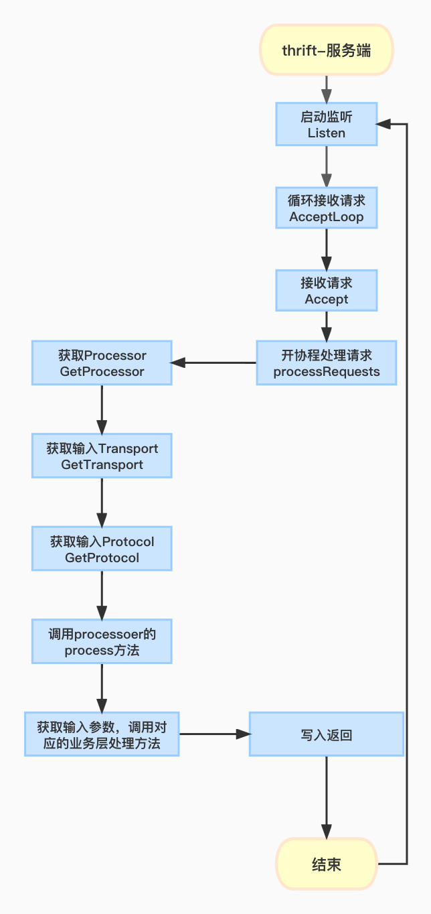
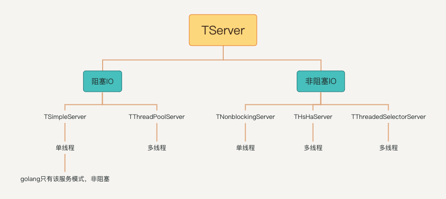

# 服务端处理流程

# 网络服务模型
Thrift提供的网络服务模型：单线程，多线程，事件驱动，从另一角度划分：阻塞服务类型，非阻塞服务类型
阻塞服务类型：TSimpleServer，TThreadPoolServer
非阻塞服务类型：TNonblockingServer， THsHaServer和TThreadedSelectorServer

上图这些都是TServer的具体实现,但是在golang只有TSimpleServer的网络服务模型.
下面我们看下一个完整的请求所经历的服务端处理流程

# 服务端Server代码
server端IDL
```thrift
include "User.thrift"
namespace go Sample

typedef map<string, string> Data

struct Response {
    1:required i32 errCode; //错误码
    2:required string errMsg; //错误信息
    3:required Data data;
}

//定义服务
service Greeter {
    Response SayHello(
        1:required User.User user
    )

    Response GetUser(
        1:required i32 uid
    )
}

service SimpleService {
    i32 add(1:i32 num1, 2:string num2)
}
```
请求样例
```go
func SimpleServer() {
	conf := &thrift.TConfiguration{
		ConnectTimeout: time.Second,
		SocketTimeout:  time.Second,
		MaxFrameSize: 1024 * 256,
		TBinaryStrictRead:  thrift.BoolPtr(true), // 读input协议，二进制
		TBinaryStrictWrite: thrift.BoolPtr(true), // 写output协议，二进制
	}
    
	// 初始化传输协议为二进制传输
	protocolFactory := thrift.NewTBinaryProtocolFactoryConf(conf)
	// 确定数据传输方式，这里返回一个tTransportFactory工厂interface
	transportFactory := thrift.NewTTransportFactory()
    
	// 初始化监听地址，以及端口等
	transport, _ := thrift.NewTServerSocket(":8090")
    // 初始化TProcessor核心处理对象，golang这里初始化的是SimpleServiceProcessor， 包含当前server下的所有业务方法，和一个方法名map
	processor := Sample.NewSimpleServiceProcessor(&handler.SimpleServiceHandler{})
	// 初始化一个TServer的实现子类，确定服务端网络模型，这里为TSimpleServer
	server := thrift.NewTSimpleServer4(processor,transport,transportFactory,protocolFactory)
	// 启动服务端
	server.Serve()
}
```
这是我在demo代码仓库中的一个例子，main函数会调用当前这个方法，来启动服务端，上述具体的代码含义我会在下面讲解
# TServerTransport(服务传输器)
```go
type TServerTransport interface {
	Listen() error
	Accept() (TTransport, error)
	Close() error

	// Optional method implementation. This signals to the server transport
	// that it should break out of any accept() or listen() that it is currently
	// blocked on. This method, if implemented, MUST be thread safe, as it may
	// be called from a different thread context than the other TServerTransport
	// methods.
	Interrupt() error
}

type TServerSocket struct {
    listener      net.Listener 
    addr          net.Addr
    clientTimeout time.Duration
    
    // Protects the interrupted value to make it thread safe.
    mu          sync.RWMutex
    interrupted bool
}
```
TServerTransport是一个interface，可以认为是服务端传输器，用来响应上游的请求。该interface分别定义了4个方法。
  * Listen：启动监听
  * Accept：接收一个请求
  * Close：关闭监听
  * Interrupt：中断/结束当前服务处理器的监听

TServerSocket是TServerTransport的一个具体实现，TServerSocket结构体中包含如下字段：
  * listener：面向协议的通用网络监听器，多个goroutine可以同时调用Listener上的方法
  * addr：监听地址， IP+port
  * clientTimeout：客户端超时时间
  * mu：读写锁，保护被中断的值，使线程安全
# TTransportFactory
```go
type TTransportFactory interface {
	GetTransport(trans TTransport) (TTransport, error)
}
type tTransportFactory struct{}

```
创建传输的封装实例工厂，从一个serverTransport获取到传输内容，然后可能想要改变他们(即基于base transport创建一个BufferedTransport)


# TSimpleServer
```go
type TSimpleServer struct {
	closed int32  // 是否处于监听状态
	wg     sync.WaitGroup // 协程管理组
	mu     sync.Mutex // 互斥锁

	processorFactory       TProcessorFactory // 对一次请求的inputProtocol和outputProtocol进行操作，处理流程中的关键函数。
	serverTransport        TServerTransport // 实现开启监听，接收请求，关闭监听等功能，TServerTransport的一个具体实现
	inputTransportFactory  TTransportFactory // 从serverTransport中获取对应的请求输入
	outputTransportFactory TTransportFactory // 处理服务端的resp
	inputProtocolFactory   TProtocolFactory // req的协议，比如二进制传输，conn超时时间，socket超时时间，最大容量等
	outputProtocolFactory  TProtocolFactory // resp的协议，比如二进制传输，conn超时时间，socket超时时间，最大容量等

	// THeaderProtocol中自动转发的报文头
	forwardHeaders []string
    // 请求或者返回日志等
	logger Logger
}
```
由于传统的TSimpleServer是阻塞式IO，实现方式简单明了，但是每次只能接收和处理一个socket链接效率比较低。但是golang的TSimpleServer在接受套接字后不会阻塞，他更像一个TThreadPoolServer，可以在不同的goroutine协程中处理不同连接。
接下来我们看下TSimpleServer是怎么实现非阻塞式IO的
```go
func (p *TSimpleServer) Serve() error {
	p.logger = fallbackLogger(p.logger)
    // 判断当前服务是否在监听中
	err := p.Listen()
	if err != nil {
		return err
	}
	// 循环接收请求
	p.AcceptLoop()
	return nil
}

func (p *TSimpleServer) AcceptLoop() error {
	// 当前实现是一个死循环，只要服务启动，这里就会一直接收请求，但是这里的依然是阻塞的
    for {
		// 接收&处理请求，底层实现在开启协程后，立刻进行下一个请求的处理
        closed, err := p.innerAccept()
        if err != nil {
            return err
        }
        if closed != 0 {
            return nil
        }
    }
}


func (p *TSimpleServer) innerAccept() (int32, error) {
	// serverTransport的类型为TServerSocket，这里接收一个请求
    client, err := p.serverTransport.Accept()
    p.mu.Lock()
    defer p.mu.Unlock()
    closed := atomic.LoadInt32(&p.closed)
    if closed != 0 {
        return closed, nil
    }
    if err != nil {
        return 0, err
    }
    if client != nil {
        p.wg.Add(1)
		// 开启协程
        go func() {
            defer p.wg.Done()
            if err := p.processRequests(client); err != nil {
                p.logger(fmt.Sprintf("error processing request: %v", err))
            }
        }()
    }
    return 0, nil
}

// p.serverTransport.Accept()实现
func (p *TServerSocket) Accept() (TTransport, error) {
	// 先加读锁，以防其他线程抢到该请求
    p.mu.RLock()
    interrupted := p.interrupted
    p.mu.RUnlock()
    
    if interrupted {
        return nil, errTransportInterrupted
    }
    // 添加写锁
    p.mu.Lock()
    listener := p.listener
    p.mu.Unlock()
    if listener == nil {
        return nil, NewTTransportException(NOT_OPEN, "No underlying server socket")
    }
	// 获取一个通用的conn
    conn, err := listener.Accept()
    if err != nil {
        return nil, NewTTransportExceptionFromError(err)
    }
	// 返回一个TTransport，具体实现是TSocket类型，使用阻塞式IO来进行数据传输
    return NewTSocketFromConnTimeout(conn, p.clientTimeout), nil
}

// listener.Accept()实现
// Accept实现Listener接口中的Accept方法;它等待下一个调用并返回一个通用的Conn
func (l *TCPListener) Accept() (Conn, error) {
    if !l.ok() {
        return nil, syscall.EINVAL
    }
    c, err := l.accept()
    if err != nil {
        return nil, &OpError{Op: "accept", Net: l.fd.net, Source: nil, Addr: l.fd.laddr, Err: err}
    }
    return c, nil
}

// p.Listen实现
// 这里的serverTransport我们以TServerSocket为例
func (p *TServerSocket) Listen() error {
    p.mu.Lock()
    defer p.mu.Unlock()
	// 判断TServerSocket的listener不为空，即确认网络监听器已经初始化过，serverTransport的实现不会初始化listener，所以这里返回为false
    if p.IsListening() {
        return nil
    }
	// 在listener为nil的情况，这里重新创建一个Listener
    l, err := net.Listen(p.addr.Network(), p.addr.String())
    if err != nil {
        return err
    }
    p.listener = l
    return nil
}
// Checks whether the socket is listening.
func (p *TServerSocket) IsListening() bool {
    return p.listener != nil
}


// p.processRequests(client)的实现
func (p *TSimpleServer) processRequests(client TTransport) (err error) {
    defer func() {
    err = treatEOFErrorsAsNil(err)
    }()
	// 获取processor，这里就是返回TSimpleServer的processorFactory变量值 = SimpleServiceProcessor对象
    processor := p.processorFactory.GetProcessor(client)
	// 获取输入
    inputTransport, err := p.inputTransportFactory.GetTransport(client)
    if err != nil {
        return err
    }
	// 获取输入的传输协议， TBinaryProtocol
    inputProtocol := p.inputProtocolFactory.GetProtocol(inputTransport)
    var outputTransport TTransport
    var outputProtocol TProtocol

    // 判断inputProtocol是否是THeaderProtocol类型，THeaderProtocol传输协议支持二进制或压缩协议作为封装协议，保持输入输出的传输协议一致
    headerProtocol, ok := inputProtocol.(*THeaderProtocol)
    if ok {
        outputProtocol = inputProtocol
    } else {
		// 查看输出协议是否已提前设置
		oTrans, err := p.outputTransportFactory.GetTransport(client)
        if err != nil {
            return err
        }
        outputTransport = oTrans
        outputProtocol = p.outputProtocolFactory.GetProtocol(outputTransport)
    }

    if inputTransport != nil {
        defer inputTransport.Close()
    }
    if outputTransport != nil {
        defer outputTransport.Close()
    }
    for {
        if atomic.LoadInt32(&p.closed) != 0 {
            return nil
        }
		// 设置respde上下文
        ctx := SetResponseHelper(
            defaultCtx,
            TResponseHelper{
            THeaderResponseHelper: NewTHeaderResponseHelper(outputProtocol),
            },
        )   
        if headerProtocol != nil {
            // We need to call ReadFrame here, otherwise we won't
            // get any headers on the AddReadTHeaderToContext call.
            //
            // ReadFrame is safe to be called multiple times so it
            // won't break when it's called again later when we
            // actually start to read the message.
            if err := headerProtocol.ReadFrame(ctx); err != nil {
                return err
            }
            ctx = AddReadTHeaderToContext(ctx, headerProtocol.GetReadHeaders())
            ctx = SetWriteHeaderList(ctx, p.forwardHeaders)
        }
        // 处理当前请求
        ok, err := processor.Process(ctx, inputProtocol, outputProtocol)
        if errors.Is(err, ErrAbandonRequest) {
            return client.Close()
        }
        if errors.As(err, new(TTransportException)) && err != nil {
            return err
        }
        var tae TApplicationException
        if errors.As(err, &tae) && tae.TypeId() == UNKNOWN_METHOD {
            continue
        }
        if !ok {
            break
        }
    }
    return nil
}

// processor.Process的具体实现
// TServer接收到rpc请求之后，调用TProcessor进行处理，TProcessor首先调用TTransport.readMessageBegin接口读出rpc调用的名称和rpc调用类型。紧接着调用GetProcessorFunction方法根据rpc调用名称，到自己的processMap中查找对应的rpc处理函数。
// 如果存在对应的rpc处理函数，则调用该处理函数，进行请求响应。不存在则抛出异常。
func (p *SimpleServiceProcessor) Process(ctx context.Context, iprot, oprot thrift.TProtocol) (success bool, err thrift.TException) {
	// 获取请求的方法名
    name, _, seqId, err2 := iprot.ReadMessageBegin(ctx)
    if err2 != nil { return false, thrift.WrapTException(err2) }
	// 真正处理请求的方法，先看当前TProcessor(这里是SimpleServiceProcessor)的processorMap是否包含当前请求的调用方法
    if processor, ok := p.GetProcessorFunction(name); ok {
        return processor.Process(ctx, seqId, iprot, oprot)
    }
	//不存在报错返回
    iprot.Skip(ctx, thrift.STRUCT)
    iprot.ReadMessageEnd(ctx)
    x24 := thrift.NewTApplicationException(thrift.UNKNOWN_METHOD, "Unknown function " + name)
    oprot.WriteMessageBegin(ctx, name, thrift.EXCEPTION, seqId)
    x24.Write(ctx, oprot)
    oprot.WriteMessageEnd(ctx)
    oprot.Flush(ctx)
    return false, x24

}

func (p *simpleServiceProcessorAdd) Process(ctx context.Context, seqId int32, iprot, oprot thrift.TProtocol) (success bool, err thrift.TException) {
    args := SimpleServiceAddArgs{}
    var err2 error
	// 从对应的传输协议中获取请求参数，根据编号进行读取
    if err2 = args.Read(ctx, iprot); err2 != nil {
        iprot.ReadMessageEnd(ctx)
        x := thrift.NewTApplicationException(thrift.PROTOCOL_ERROR, err2.Error())
        oprot.WriteMessageBegin(ctx, "add", thrift.EXCEPTION, seqId)
        x.Write(ctx, oprot)
        oprot.WriteMessageEnd(ctx)
        oprot.Flush(ctx)
        return false, thrift.WrapTException(err2)
    }
    iprot.ReadMessageEnd(ctx)
    
    tickerCancel := func() {}
    // 开始一个协程来进行服务器链接检测
	// ServerConnectivityCheckInterval被定义为一个TProcessorFunc实现中连接检查使用的定时器间隔，他是一个变量而不是常量
    if thrift.ServerConnectivityCheckInterval > 0 {
        var cancel context.CancelFunc
        ctx, cancel = context.WithCancel(ctx)
        defer cancel()
        var tickerCtx context.Context
        tickerCtx, tickerCancel = context.WithCancel(context.Background())
        defer tickerCancel()
        go func(ctx context.Context, cancel context.CancelFunc) {
        ticker := time.NewTicker(thrift.ServerConnectivityCheckInterval)
        defer ticker.Stop()
        for {
            select {
                case <-ctx.Done():
                    return
                case <-ticker.C:
                    if !iprot.Transport().IsOpen() {
                        cancel()
                        return
                    }
                }
            }
        }(tickerCtx, cancel)
    }
    // 初始化返回的struct
    result := SimpleServiceAddResult{}
    var retval int32
	// 调用handler业务层的Add方法
    if retval, err2 = p.handler.Add(ctx, args.Num1, args.Num2); err2 != nil {
        tickerCancel()
        if err2 == thrift.ErrAbandonRequest {
            return false, thrift.WrapTException(err2)
        }
        x := thrift.NewTApplicationException(thrift.INTERNAL_ERROR, "Internal error processing add: " + err2.Error())
        oprot.WriteMessageBegin(ctx, "add", thrift.EXCEPTION, seqId)
        x.Write(ctx, oprot)
        oprot.WriteMessageEnd(ctx)
        oprot.Flush(ctx)
        return true, thrift.WrapTException(err2)
    } else {
        result.Success = &retval
    }
    tickerCancel()
    if err2 = oprot.WriteMessageBegin(ctx, "add", thrift.REPLY, seqId); err2 != nil {
        err = thrift.WrapTException(err2)
    }
	// 将业务处理结果写入到outputProtocol
    if err2 = result.Write(ctx, oprot); err == nil && err2 != nil {
        err = thrift.WrapTException(err2)
    }
    if err2 = oprot.WriteMessageEnd(ctx); err == nil && err2 != nil {
        err = thrift.WrapTException(err2)
    }
    if err2 = oprot.Flush(ctx); err == nil && err2 != nil {
        err = thrift.WrapTException(err2)
    }
    if err != nil {
        return
    }
    return true, err
}

func (p *SimpleServiceAddResult) Write(ctx context.Context, oprot thrift.TProtocol) error {
    if err := oprot.WriteStructBegin(ctx, "add_result"); err != nil {
        return thrift.PrependError(fmt.Sprintf("%T write struct begin error: ", p), err) 
	}
    if p != nil {
		// 根据返回的序号填入返回值
        if err := p.writeField0(ctx, oprot); err != nil { return err }
    }
    if err := oprot.WriteFieldStop(ctx); err != nil {
        return thrift.PrependError("write field stop error: ", err) 
	}
    if err := oprot.WriteStructEnd(ctx); err != nil {
        return thrift.PrependError("write struct stop error: ", err) 
	}
    return nil
}

func (p *SimpleServiceAddResult) writeField0(ctx context.Context, oprot thrift.TProtocol) (err error) {
	// 因为thrift的输入或者返回参数都是指针类型，所以IsSetSuccess，这里需要判断当前返回的result的各项参数指针是否为nil。
	// 如果返回参数未赋值，则其只是初始化，则对应的变量为nil
    if p.IsSetSuccess() {
        if err := oprot.WriteFieldBegin(ctx, "success", thrift.I32, 0); err != nil {
            return thrift.PrependError(fmt.Sprintf("%T write field begin error 0:success: ", p), err) 
        }
        if err := oprot.WriteI32(ctx, int32(*p.Success)); err != nil {
            return thrift.PrependError(fmt.Sprintf("%T.success (0) field write error: ", p), err) 
        }
        if err := oprot.WriteFieldEnd(ctx); err != nil {
            return thrift.PrependError(fmt.Sprintf("%T write field end error 0:success: ", p), err) 
        }
    }
    return err
}
```
所以综上所述，我们可以看到golang在实现非阻塞TSimpleServer时，是通过innerAccept方法中的协程来实现的。

# 服务端stop
```go
func (p *TSimpleServer) Stop() error {
	p.mu.Lock()
	defer p.mu.Unlock()
	if atomic.LoadInt32(&p.closed) != 0 {
		return nil
	}
	atomic.StoreInt32(&p.closed, 1)
	p.serverTransport.Interrupt()
	p.wg.Wait()
	return nil
}
func (p *TServerSocket) Close() error {
   var err error
   p.mu.Lock()
   if p.IsListening() {
      err = p.listener.Close()
      p.listener = nil
   }
   p.mu.Unlock()
   return err
}

func (p *TServerSocket) Interrupt() error {
   p.mu.Lock()
   p.interrupted = true
   p.mu.Unlock()
   p.Close()
   
   return nil
}

```

代码比较简单，可以看出从内存中获取p.closed，如果不为0 ，则表示已经关闭。如果为0，则更新当前closed的值为1，表示已关闭。同时读取Interrupt，并且关闭监听。