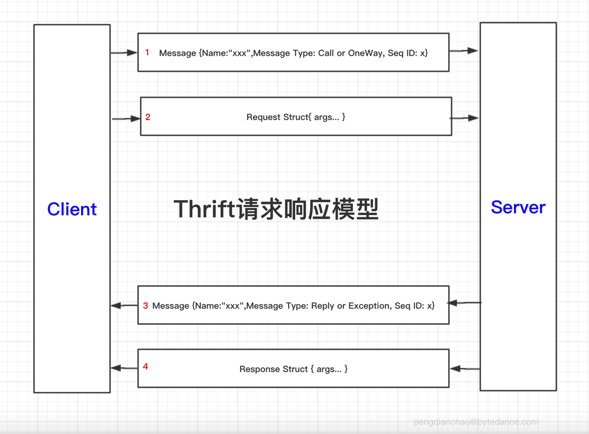

# Thrift请求响应模型

thrift的官方Doc中将thrift的请求响应描述为上述的四个步骤。最外层只有Message和Struct。这里可以将Message和Struct类比为TCP中的首部和负载，Message中放的事元信息(metadata)，Struct则包含的是具体传递的数据(payload)。
这里应该理解为字节流，2的字节流紧跟在1的数据后面，4的数据紧跟在3的数据后面。

# 深入Message和Struct
## Message
message中包含Name，Message Type， Sequence Id等数据。
* Name：调用方法的名字
* Message Type：

      INVALID_TMESSAGE_TYPE TMessageType = 0 // 无效type
  
      CALL                  TMessageType = 1 // 调用远程方法，并且期待对方发送响应
  
      REPLY                 TMessageType = 2 // 调用远程方法，不期待响应，即没有3，4步
  
      EXCEPTION             TMessageType = 3 // 表明处理完成，响应正常返回
  
      ONEWAY                TMessageType = 4 // 表明处理出错

* Sequence Id：序列号，有符号的四字节整数，在一个传输层的连接上所有未完成的请求必须有唯一的序列号，客户端使用序列号来处理响应失序到达，实现请求和响应的匹配。服务端不需要检查序列号，也不能对序列号有任何逻辑依赖。只需要响应的时候将其原样返回即可。

## Struct
在上面的Thrift请求响应模型中，有两种Struct：
* Request Struct
* Response Struct

这两种Struct结构是一样，都是由多个Field组成。

# Thrift序列化协议
Thrift支持多种序列化协议，常用的有：Binary，Compact，json。我们这里只分析下Binary和Compact
## Binary序列化
binary序列化是一种二进制序列化方式。不可读，但是传输效率高。头条的绝大部分都kite服务都是采用的Binary序列化方式。

## Message的序列化
Message的序列化分位2种，strict encoding和old encoding。在有些视线中，会通过检查thrift消息的第一个bit来判断使用了使用那种encoding：
* 1 ：strict encoding
* 0 ：old encoding

todo 待补充图片

## Struct的序列化
Struct装的是thrift通信的实际参数，一个Struct由许多基本类型组合而成，要了解Struct怎么序列化，就必须知道这些基本类型的序列化。

| 类型名 | idl类型名| 占用字节数 | 类型ID |
| ----  | ----    | ----     | ----   |
| bool  | bool    | 1        |  2     |
| byte  | byte    | 1        |  3     |
| short | i16     | 2        |  6     |
| int   | i32     | 4        |  8     |
| long  | i64     | 8        |  10    |
| double| double  | 8        |  4     |
| string| string  | 4+N      |  11    |
| []byte| binary  | 4+N      |        |
| list  | list    | 1+4+N    |  15    |
| set   | set     | 1+4+N    |  14    |
| field |         | 1+2+X    |  3     |
| struct| struct  | N * X    |  12    |
| enum  |         |          |        |
| union |         |          |        |
| exception  |    |          |        |

### 定长编码
上表中bool，byte，short，int，long，double采用的是固定字节编码，各类型占用的字节数见上表

### 长度前缀编码(4+N)

string，byte，array采用的是长度前缀编码，前四个字节(无符号四字节整数)表示长度，后面跟着的就是实际的内容。

### map的编码(1+1+4+NX+NY)

其中key-type和value-type可是是任意基本类型。注意将此处的map与python中的dict区分，这里的key和value各自都必须是同种类型，而python中的dict是多态字典

### list和set的编码(1+4+N*X)

这里的list和set中的元素都必须是同一种类型

### field的编码(1+2+X)

field不是一个实际存在的类型，而是一个抽象概念。field不独立出现，而是出现在struct内部，其中field-type可以是任何类型，field-id就是定义IDL时该field在struct的编号，field-value是对应类型的值得序列化结果。
struct的编码，一个struct就是多个field编码而成，最后一个field排列完成之后就是一个stop field，这个field是一个8bit全为0的字节，他标志着一条thrift消息的结束。
```go
---------------------------------------------
| field1 | field2 |...| fieldN | stop field |        stop field: 00000000 
|    M   |    M   |...|    M   |   00000000 |   所以Message Type编码的时候不能用0
---------------------------------------------
```
thrift序列化的时候并没有将字段名序列化进去，所以在idl文件中更改字段名是没有任何影响的。因为客户端和服务端使用的是同一个IDL文件，所以在对应的时候可以根据Sequence ID进行对应

# Transport

