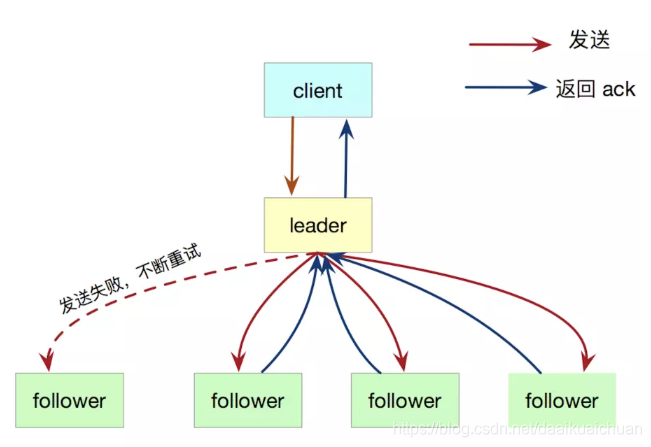
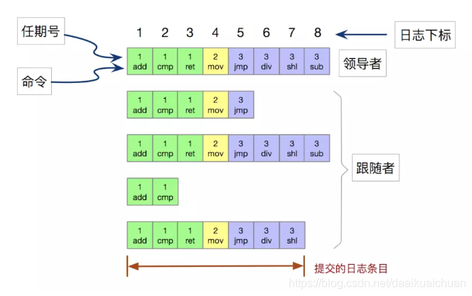
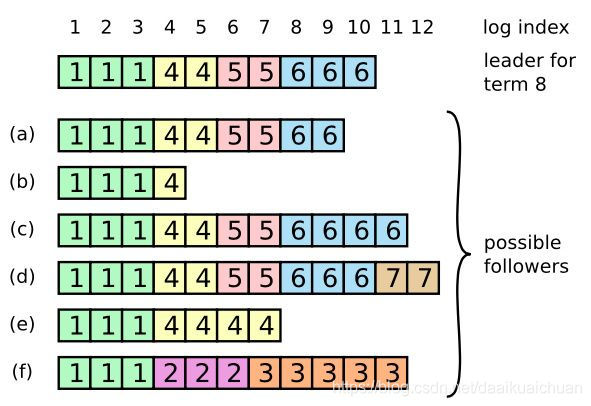
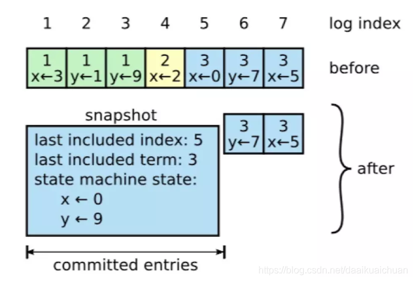

## 到底什么是一致性？   
官方说法是：多个服务器节点的数据保持一致， 如果在深入探讨的话，就会谈到分布式一致性算法，比如Paxos，raft之类的。还有CAP定理，也跟一致性有关。

## ACID中的一致性 
ACID是数据库事务的四个特性，分别是原子性 (Atomicity)、一致性 (Consistency)、隔离性 (Isolation)和持久性 (Durability)。

我们现在关注的是其中的C。通俗的讲他是指任何一个数据库事务的执行，都应该让整个数据库保持在「一致」的状态。
* ACID中的一致性，是对整个数据库的一致状态的维持，抽象来看，对数据库每进行一次事务操作，他的状态就发生一次变化，这相当于把数据库看成了状态机，只要数据库的起始状态是「一致」的，并且每次事务操作都能保持「一致性」，那么数据库就能始终保持在「一致」的状态上
* 所谓的一致性是由业务来决定的，比如转账的例子，转账前后账户总额保持不变，这个规定只对转账的场景生效。  所以说，ACID中的「一致性」，其实是体现了业务逻辑上的合理性，并不是由数据库本身的技术特性所决定的。

## 为了让事务总是能保持ACID的一致性，我们需要考虑什么因素呢？       
至少考虑两方面：一个是出错情况；一个是并发情况      

出错情况：  
    首先对于任何系统来说，错误都是在所难免的。而错误又分为两类：        

* 编码层面事务本身的实现逻辑可能存在错误；从账户A向账户B转账100元，在这个事务中，如果我们只从账号A中减去了100元，但忘记了往账户B中增加100元，那么这个事务就是错误的。

* 第二种则是意想不到的软硬件错误。比如，还是从账户A向账户B转账100元，事务本身的实现逻辑没有问题，它先执行了从账号A中减去了100元，但在执行往账户B中增加100元之前，却发生了意想不到的错误，比如进程突然crash了，或是磁盘满了，或是网络突然不通了，或是其它任何可能的硬件错误。这个时候事务只执行了前一半，势必会破坏数据库整体状态的一致性。这个时候就需要ACID中的A(原子性)来保证了。简单来说就是原子性可以保证事务要么全部执行完，要么都不执行

并发情况：          
并发行为也可能影响事务的一致性。在数据库系统中，并发行为体现在可能存在多个事务同时操作同一份数据的情况。还是拿前面转账的例子来说，假设有两个事务：事务1从账户A向账户B转账100元，事务2从账户A向账户C转账50元。如果两个事务先后顺序执行，自然没有问题。但如果两个事务同时执行了，那么可能会出现下面的执行序列（假设账号A的初始余额为x元）：
1. <事务1>：读取账户A的余额，读到了x元；
2. <事务2>：读取账户A的余额，也读到了x元；
3. <事务1>：向账户A中写入(x-100)元；
4. <事务2>：向账户A中写入(x-50)元；

这样执行下来肯定是不对的，所以需要保证事务和事务之间不能相互干扰，这就需要ACID中的I（隔离性）来保障了，什么是隔离性呢？它对于并发执行的多个事务进行合理的排序，保证不同事物之间的执行互不干扰。

经过上面的分析，现在关于ACID中的一致性，我们可以得到一些结论了：
* ACID中的一致性，是个偏向应用层的概念。这跟ACID中的原子性，隔离性和持久性有很大的不同。原子性、隔离性和持久性，都是数据库本身所提供的技术特性；而一致性，则是由特定的业务场景规定的。

* 要真正做到ACID的一致性，他要依赖数据库的原子性和隔离性。但是，就算数据库提供了所有你所需要的技术特性，也不一定能保证ACID的一致性。这还取决于你在应用层对于事务本身的实现逻辑是否正确无误。

* 最后ACID中的一致性，甚至和分布式没有什么关系，它跟分布式的唯一关联在于，在分布式环境下，它所依赖的数据库原子性和隔离性更难实现。

总之，ACID中的一致性，是一个非常特殊的概念。除了数据库事务处理，它很难扩展到其它场景，也跟分布式理论中的其它「一致性」概念没有什么关系。

## 分布式事务与一致性算法的关系     

先说一致性问题。这是分布式系统中的一个十分基础而核心的问题，它表示如何在分布式系统中的多个节点之间就某件事达成一致/共识     

网上经常提到的分布式一致性算法，就是解决这里的一致性问题的算法。这些一致性算法通常包括paxos算法，谅解点提交协议(2pc)或者三阶段提交协议(3pc)

## 基本原则与理论   

分布式系统的一致性问题，可以根据是否存在恶意节点分为两类。无恶意节点，是指节点丢失，重发，不响应消息，但不会篡改消息。而恶意节点可能会篡改消息。有恶意节点的问题称为拜占庭将军问题。paxos协议很好的解决了无恶意节点的分布式的一致性问题

分布式中的一致性是非常重要的，分为弱一致性和强一致性。现在主流的一致性协议一般选择弱一致性的特殊版本：最终一致。

CAP理论：（一致性，可用性，分区容错性）是当前分布式系统公认的理论，亦即一个分布式系统不可能同时满足这三个特性，只能求其二。对于分布式系统容错性是其最基本的要求。

ACID：（Atomicity原子性，Consistency一致性，Isolation隔离性，Durability持久性）是事务的特点，具有强一致性，一般用于单机事务，分布式事务若采用这个原则会丧失一定的可用性，属于CP系统。

BASE：(基本可用，软状态，最终一致)，理论是对大规模的互联网分布式系统实践的总结，用弱一致性来换取可用性。不同于ACID，属于AP系统

## 2PC算法
两阶段提交，系统有两个角色协调者和参与者，事务提交过程分为两阶段：
1. 提交事务（投票阶段）
    * 协调者向参与者发送事务内容，询问是否可以执行事务提交操作，等待响应。
    * 参与者执行事务操作，并将undo和redo日志记录
    * 参与者回复协调者，执行成功则回yes或者no
2. 执行事务提交(执行阶段)
    * 如果参与者都回复Yes，则协调者向参与者发送提交请求，否则发送回滚请求
    * 参与者根据协调者的请求执行事务提交或回滚，并向协调者发送ack消息
    * 协调者收到所有的ack消息后判断事物的完成或者中断

该协议被视为强一致的算法，通常用来保证多份数据操作的原子性，也可以实现数据副本之间的一致性，实现简单的，但是缺点也很多，比如单点故障（协调者挂了整个系统就没法对外服务，任一节点挂了事务就没法执行，没有容错机制），阻塞（两个阶段都涉及同步等待阻塞，极大降低了吞吐量），数据不一致（参与者回复Yes/No后如果因为网络原因没有收到提交/中断请求，此时它就不知道该如何操作了，导致集群数据不一致）

2pc有一些优化手段：
* 超时判断机制；比如协调者发出事务请求后等待所有参与者的反馈，，若超过时间没有搜集完毕所有回复则可以取消本次事务；
* 互询问机制；参与者P回复yes后，等待协调者发起最终的commit，如果没有收到那么可以询问其他参与者来决定自身下一步操作，避免一直阻塞。所以2PC的阻塞问题是没办法彻底解决的。

2PC广泛应用于关系数据库的分布式事务处理，如mysql的内部与外部XA都是基于2PC的

## 3pc

三阶段提交是二阶段提交的改进版本，系统也有两个角色协调者和参与者

事务提交过程分为三阶段：
1. 事务询问(can commit)
     * 协调者向参与者发送一个包含事务内容的询问请求，询问是否可以执行事务并等待
    * 参与者根据自己的状态判断并回复yes/no
2. 执行事务预提交（preCommit）
    * 若协调者收到的都是yes，就发送preCommit请求否则发布回滚请求
    * 参与者若收到了precommit则执行事务操作并记录undo和redo然后发送ack，若收到了回滚或者超时则中断事务
3. 执行事务提交（docommit）
    * 协调者收到所有的ack则发送docommit请求，若收到了no或者超时则发送回滚请求
    * 参与者收到docommit就执行提交并发送ack，否则执行回滚并发送ack
    * 协调者收到ack判断是完成事务还是中断事务

三阶段相对于两阶段的改善就是把准备阶段一分为二，多加了一个cancommit阶段，在这就类似于TCP的三次握手，多了一次确认，增大了事务的执行成功的概率。而且3pc的协调者即使出了故障，参与者也能继续执行事务，所以解决了2pc的阻塞问题，但是也可能因此导致集群数据不一致。

## Paxos  
paxos算法的核心问题是：解决分布式系统的一致性问题，所有问题均围绕着在分布式环境达成一致性而展开讨论的，paxos算法为了打成一致性，算法必须保证其安全性和活性：
* 安全性：只有被提出的提案才能被选定，并且只有一个提案被选定
* 活性： 最终保证会有一个天会被选定 

上面的两个协议的协调者都需要人为设置而无法自动生成，是不完整的分布式协议，而paxos就是一个真正的完整的分布式算法。系统一共有几个角色：proposer（提出议案，一个提案由一个编号及value形成的对组成，如 [m, value]，提案的编号必须是全局唯一，value即代表了提案本身的内容），acceptor（参与决策），learner（不参与提案，只负责接收已确定的提案，一般用于提高集群对外提供度服务的能力）。实践中一个节点可以同时充当多个角色，提案选举过程也大概分为2个部分：
1. prepare阶段
    * proposer选择一个提案编号M，向acceptor某个超过半数的子集成员发送该编号的prepare请求
    * acceptor收到M编号的请求，若M大于Acceptor已经响应的所有prepare请求的编号中最大的最大编号N，那么他将N反馈给proposer，同时承诺不会在批准任何编号小于M的提案

2. accept阶段
    * 如果proposer收到超过半数的accept对于M的prepare请求的响应，就发送一个针对[M,V]提案的Accept请求给Acceptor，其中V是收到的响应编号中编号的最大的提案值，如果响应中不包括任何提案值，那么他就是任意值
    * Acceptor收到这个针对[M,V]的Accept请求只要该Acceptor尚未对大于M编号的提案做出过响应，他就通过这个提案

3. Learn阶段（本阶段不属于选定提案的过程）
    * Proposer将通过的提案同步到所有的Learner

## raft协议

1. raft是一个用于解决分布式一致性问题的算法，他将分布式一致性问题分解为多个子问题：leader选举，日志复制，安全性，日志压缩等。raft将系统中的角色分为leader（领导者），follower（跟随者），Candidate（候选者）
    *  leader：接受客户端请求，并向follower同步请求日志，当日志同步到大多数节点上后告诉follower提交日志
    * follower：接受并持久化leader同步的日志，在leader告之日志可以提交之后，提交日志    
    * Candidate：Leader选举过程中的临时角色。

    reft要求系统在任意时刻最多只有一个leader，正常工作期间只有leader和followers。raft算法将时间分为一个个任期，每一个term的开始就是leader选举。在成功选举leader之后，leader会在整个trem内管理集群。如果leader选举失败，该trem就会因为没有leader而结束。
2. 任期 （term）        
raft算法将时间划分为任意不同长度的任期。任期用连续的数字表示。每一个任期的开始都是一次选举（election），一个或多个候选人会试图成为领导人。如果一个候选人赢得了选举，它就会在该任期的剩余时间担任领导人。在某些情况下，选票会被瓜分，有可能没有选出领导人，那么，将会开始另一个任期，并且立刻开始下一次选举。Raft 算法保证在给定的一个任期最多只有一个领导人。

3. RPC  
raft算法中服务器节点之间通信使用远程过程调用，并且基本的一致性算法只需要两种类型的rpc，为了在服务器之间传输快照增加了第三种 RPC。
    * RequestVote RPC：候选人在选举期间发起。
    * appendentries rpc：领导人发起的一种心跳机制，复制日志也在该命令中完成
    * installSnapshot Rpc：领导者使用该rpc发送快照给太落后的追随者

4. Leader选举   

    * lender选举的过程      
    1）raft使用心跳出发leader选举。当服务器启动时，初始化为follower。leader向所有follower周期性发送心跳请求。如果follwer在选举超时时间内没有收到来自leader的心跳请求，就会等待一段时间随机发起一次leader选举。每一个follower都有一个时钟，是一个随机值，表示的是follower等待成为leader的时间，谁的时钟先跑完，则发起leader选举。    
    2）Follower将其当前term加一然后转换为Candidate。他先给自己投票并且给集群中的其他服务器发送RequestVote RPC。结果有以下三种情况
        * 赢得了多数的选票，成功选举为Leader；
        * 收到leader的消息，表示有其他服务器已经抢先当选了leader
        * 没有赢得多数服务器的选票，Leader选举失败，等待选举时间超时后发起下一次选举。

        

    * Leader选举的限制 
    1）在raft协议中，所有的日志条目都只会从leader节点网follower节点写入，且leader节点上的日志会增加，绝对不会删除或者覆盖。这意味着leader节点必须包含所有已提交的日志，即能被选举为Leader的节点一定需要包含所有的已经提交的日志。因为日志是从leader到follwer传输的，所以如果被选举的出的leader缺少commit的日志，那么这些已提交的日志就会丢失，显然这是不符合要求的。

        这就是Leader选举的限制：能被选举成为Leader的节点，一定包含了所有已经提交的日志条目。

5. 日志复制 
    * 日志复制的过程    
    1）raft 的日志复制过程（共识算法）是基于复制状态机来实现，raft 复制状态机包括三个模块，分别是共识模块、日志模块以及状态机。leader选出后，就开始接收客户端的请求，leader把请求作为日志条目加入它的日志中，然后并行向其他服务器发起AppendEntries RPC复制日志条目，当这条日志被复制到了大多数服务器上，Leader将这条日志应用到它的状态机并向客户端返回执行结果。
        * 客户端的每一个请求都包含被复制状态机执行的指令
        * leader把这个指令作为一条新的日志条目添加到日志中，然后并行发起 RPC 给其他的服务器，让他们复制这条信息。
        * 假如这条日志被大多数跟随者附加到本地日志，并返回sucess，领导人就应用这条日志到自己的状态机中，并返回给客户端。
        * 当跟随者收到下一次领导者的心跳请求或者新的日志复制请求之后，如果发现领导者已经应用了之前的日志，但是它自己还没有之后，那么它便会把这条日志项应用到本地状态机中。
        * 如果follower宕机或者运行缓慢或者丢包，leader会不断的重试，直到所有的 follower 最终都复制了所有的日志条目。

        

    * 日志的组成    
    1） 日志是由有序编号的日志条目组成，每个日志条目包含它被创建时的任期号（term）和用于状态机执行的命令。如果一个日志条目被复制到了大多数服务器上，就被认为可以提交了。
    
    上图显示，共有 8 条日志，提交了 7 条。提交的日志都将通过状态机持久化到磁盘中，防止宕机。
6. 日志的一致性      
    * 日志复制的两条保证        
    1） 如果不同日志中的两个条目有着相同的索引和任期号，则它们所存储的命令是相同的，原因：leader最多在一个任期里的一个日志索引位置创建一条日志条目，日志条目在日志的位置从来不会改变。  
    2）如果不同日志中的两个条目有着相同的索引和任期号，则他们之前的所有条目都是完全一样的。原因：每次rpc发送附加日志时，leader会把日志条目的前面的日志的下标和任期号，一起发送给follower，如果follower发现和自己的日志不匹配，那么就拒接接受这条日志，这个称之为一致性检测  
    * 日志的不正常情况  
    一般情况下，leader和follower的日志保持一致，因此AppendEntries一致性检查通常不会失败。然而，leader崩溃可能会导致日志不一致：：旧的Leader可能没有完全复制完日志中的所有条目。     
    下图阐述了一些Followers可能和新的Leader日志不同的情况。一个follower可能会丢掉leader上的一些条目，也有可能包含一些Leader没有的条目，也有可能两者都会发生，丢失的或者多出来的条目可能会持续多个任期。
        
    * 如何保证日志的正常复制    
    1）leader通过强制follower复制他的日志来处理日志不一致的情况，follower上的不一致日志会被leader的日志覆盖。leader为了使follower的日志同自己一致，leader需要找到follower同它日志一致的地方，然后覆盖follower在该位置之后的条目     
    2）具体操作是：leader会从后往前试，每次AppendEntries失败后尝试前一个日志条目，直到成功找到每个follower的日志一致位置点，然后向后逐条覆盖followers在该位置之后的条目。携带当前日志信息以及 PrevLogTerm 和 PrevLogIndex，跟随者接收到日志复制请求之后，会根据 PrevLogTerm 和 PrevLogIndex 去本地日志查找数据是否存在，存在则返回成功，不存在返回fail。leader根据返回在决定是往前继续探测（失败），（成功）还是往后直接复制

    总结一下就是：当 leader 和 follower 日志冲突的时候，leader 将校验 follower 最后一条日志是否和 leader 匹配，如果不匹配，将递减查询，直到匹配，匹配后，删除冲突的日志。这样就实现了主从日志的一致性。

7. 安全性       
    raft增加了如下两条限制来保证安全性：        
    * 拥有最新的已提交才有资格成为leader
    * leader只能推进commit index来提交当前term的已经复制到大多数服务器上的日志，旧的term日志的提交要等到提交当前term的日志的间隙来提交
8. 日志压缩         
在实际的系统中，不能让日志无限增长，否则系统重启时需要花很长的时间进行回放，从而影响可用性。Raft采用对整个系统进行快照来解决，快照
之前的日志都可以丢弃（以前的数据已经落盘了）。

每个副本独立的对自己的系统进行快照，并且只能对已提交的日志记录进行快照。

快照包涵一下内容：  
* 元日志数据，最后一条已提交的log entry的log index和trem。这两个值在快照之后的第一条log entry的AppendEntries RPC的完整性检查的时候会被用上
* 系统当前的状态 
    * 当Leader要发给某个日志落后太多的Follower的log entry被丢弃，Leader会将snapshot发给Follower。或者当新加进一台机器时，也会发送snapshot给它。发送snapshot使用InstalledSnapshot RPC。  
    * 做snapshot既不要做的太频繁，否则消耗磁盘带宽， 也不要做的太不频繁，否则一旦节点重启需要回放大量日志，影响可用性。推荐当日志达到某个固定的大小做一次snapshot。
    * 做一次snapshot可能耗时过长，会影响正常日志同步。可以通过使用copy-on-write技术避免snapshot过程影响正常日志同步。

9. 投票原则 
* 每个follower自己的任期编号是否小于需要投票的目标任期编号，如果不小于那么他会拒绝投票
* 自己在任期内是否已经投过票，如果已经投过了那么他同样会拒绝投票
* 如果对方的日志完整性低于自己本地的日志完整性，那么拒绝投票

    当以上情况都满足的时候，它便会投出自己宝贵的一票，并增加自己的任期编号，然后拒绝此任期内的所有其他投票请求。

10. 面试题       
* raft中任何节点都可以发起选举吗？  
raft发起选举的情况有如下几种情况
    * 刚启动时，所有节点都是follower，这个时候发起选举，选出一个leader
    * 当leader挂掉之后，时钟先跑完的follower发起重新选举操作，选出一个leader
    * 成员变更的时候会发起选举操作 
* raft中选举中给候选人投票的前提    
raft确保新当选的leader包含所有已提交的日志条目。这个保证是在RequestVoteRPC阶段做到，candidate在发送自己RequestVoteRPC时，会带上自己的last log entry的term_id和index，follower在接收到RequestVoteRPC消息时，如果发现自己的日志比rpc中的更新，就拒绝投票。日志比较的原则是，如果本地的最后一条log entry的term id更大，则更新，如果term id一样大，则日志更多的更大(index更大)。

* raft数据一致性如何实现的  
主要是通过日志复制实现数据的一致性，leader将请求指令作为一条新的日志条目添加到日志中，然后发起rpc给所有的follower，进行日志复制，进而同步数据
* Raft的日志有什么特点？    
日志由有序编号（log index）的日志条目组成，每个日志条目包含它被创建时的任期号（term）和用于状态机执行的命令。

* raft里面怎么保证数据被commit，leader宕机了怎么办，之前的没提交的数据会怎么样      
leader会通过rpc向follower发出日志复制的，等待所有的follower复制完成，这个过程是阻塞的。

    老的leader里面没提交的数据会回滚，然后同步新leader的数据。

* raft中的日志压缩是怎么实现的？增加或删除节点呢？  
1）在实际的系统中，不能让日志无限增长，否则系统重启时需要花很长的时间进行回放，从而影响可用性。Raft采用对整个系统进行快照来解决，快照之前的日志都可以丢弃（以前的数据已经落盘了）。    
2）快照里面主要记录的是日志元数据，即最后一条已提交的 log entry的 log index和term。

* Raft里面的租约机制是什么，有什么作用？   
租约机制确保了一个时刻最多只有一个leader，避免只使用心跳机制产生双主问题。中心思想是每次租约时长内只有一个节点获得租约、到期后必须重新颁发租约。