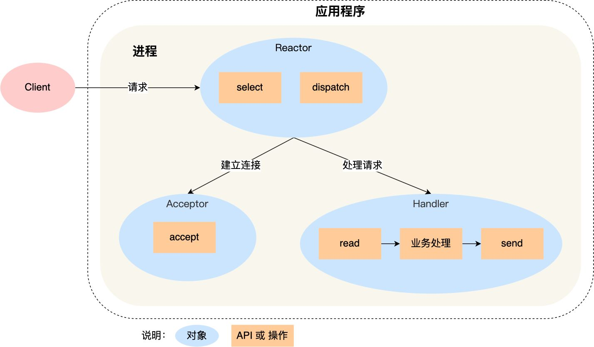

1. 讲到高性能IO绕不开reactor模式，它是大多数IO相关组件如Netty、Redis在使用的IO模式，为什么需要这种模式，它是如何设计来解决高性能并发的呢？

    最原始的网络编程思路是用一个while循环，不断监听端口是否有新的套接字连接，如果有就用一个处理函数处理，类似如下：
    ```golang
    while(true){ 
    socket = accept(); 
    handle(socket) 
    } 
    ```

    这种方法的最大问题是无法并发，效率太低，如果当前请求没有处理完，那么后面的请求也只能被阻塞住。之后，想到了使用多线程，
    ```golang
    while(true){ 
    socket = accept(); 
    new thread(socket); 
    } 
    ```
    线程的方式确实一定程度上极大地提高了服务器的吞吐量，因为之前的请求在read阻塞以后，不会影响到后续的请求，因为他们在不同的线程中。这也是为什么通常会讲“一个线程只能对应一个socket”的原因。最开始对这句话很不理解，线程中创建多个socket不行吗？语法上确实可以，但是实际上没有用，每一个socket都是阻塞的，所以在一个线程里只能处理一个socket，就算accept了多个也没用，前一个socket被阻塞了，后面的是无法被执行到的。缺点在于资源要求太高，系统中创建线程，销毁线程是需要比较高的服务器资源。每一次线程把一次交互的事情都做了，包括读取和返回，甚至连接。所以，目前的方案线程里可以看成要做三件事，连接，读取和写入。线程同步的粒度太大了，限制了吞吐量，应该把一次连接的操作分为更细的粒度或者过程。这其实就是Reactor出现的原因，

   事实上，reactor模式即i/o多路复用的监听事件，收到事件后，根据事件类型分配给某个进程/线程  

   reactor模式主要由reactor和处理资源这两部分核心组成，他们负责的事情如下： 
   * Reactor 负责监听和分发事件，事件类型包含连接事件、读写事件；
   * 处理资源池负责处理事件，如 read -> 业务逻辑 -> send；  

    reactor的模式是灵活多变的，可以应对不同场景，灵活在于：
    * Reactor 的数量可以只有一个，也可以有多个；
    * 处理资源池可以是单个进程 / 线程，也可以是多个进程 /线程；

2. 单 Reactor 单进程 / 线程 

    可以看到进程中有reactor，acceptor，hanndler这三个对象： 
    * reactor对象的作用是监听和分发事件 
    * acceptor对象的作用是获取连接；
    * Handler 对象的作用是处理业务；
对象中的select，accpet，read，send是系统调用函数，dispatch和业务处理是需要完成的操作，其中dispatch是分发事件操作

    流程：  
    * reactor对象通过select（io多路复用接口）监听事件，收到事件后通过dispatch进行分发，具体分发给accetpor对象还是Handler 对象，还要看收到的事件类型；
    * 如果是建立连接的事件，则交由acceptor对象进行处理，acceptor对象通过accpet方法获取连接，并创建一个handler对象来处理后续的响应事件；
    * 如果不是连接建立事件， 则交由当前连接对应的 Handler 对象来进行响应；
    * Handler 对象通过 read -> 业务处理 -> send 的流程来完成完整的业务流程。
    
    缺点：  
    * 因为只有一个进程，没法发挥多核cpu的性能
    * handler对象在业务处理时，整个进程是无法处理其他连接事件的如果业务处理耗时比较长，那么就造成响应的延迟
    
    
3. 单 Reactor 多线程 / 多进程       
基于以上方案的缺点，就引入了单reactor多进程/线程的方法：

流程：  
    * Reactor 对象通过 select （IO 多路复用接口） 监听事件，收到事件后通过dispatch进行分发，具体分发给 Acceptor 对象还是 Handler 对象，还要看收到的事件类型；
    * 如果是连接建立的事件，则交由acceptor对象来处理，acceptor对象通过accpet方法获取连接，并创建一个 Handler 对象来处理后续的响应事件；
    * 如果不是连接建立事件，则交由当前连接对应的 Handler 对象来进行响应；
    * headler对象不在负责业务处理，只负责数据的接收和发送，headler对象通过read读取到数据后，会将数据发给子线程里的processor对象处理
    * 子线程里的 Processor 对象就进行业务处理，处理完后，将结果发给主线程中的 Handler 对象，接着由 Handler 通过 send 方法将响应结果发送给 client；

    问题：  
    另外，「单 Reactor」的模式还有个问题，因为一个 Reactor 对象承担所有事件的监听和响应，而且只在主线程中运行，在面对瞬间高并发的场景时，容易成为性能的瓶颈的地方。
